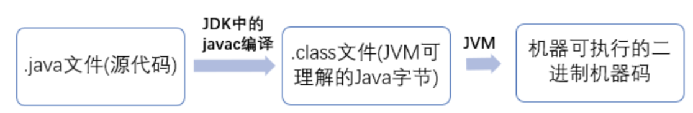

### 一、 JVM是什么

JVM 是一个虚拟机，是 Java Virtual Machine（Java 虚拟机）的缩写，JVM 的存在使得 Java 程序的运行与操作系统无关，Java 程序只需要在 JVM 上生成字节码文件，就可以在多平台上运行（ WORA, Write Once Run Anywhere）。

#### 1 Java 程序从源代码到运行

从 .class 文件到机器码的这一步：JVM 类加载器首先 加载字节码文件，然后通过解释器逐行解释执行，这种方式的执行速度会相对比较慢。而且，有些方法和代码块是经常需要被调用的(也就是所谓的热点代码)，所以后面引进了 JIT 编译器，而 JIT 属于运行时编译。当 JIT 编译器完成第一次编译后，其会将字节码对应的机器码保存下来，下次可以直接使用。而我们知道，机器码的运行效率肯定是高于 Java 解释器的。这也解释了我们为什么经常会说 Java 是编译与解释共存的语言。 

### 二、JDK, JRE和JVM

 **JDK（Java Development Kit，Java开发工具包）** 是程序开发者**用来编译、调试java程序用的开发工具包。**JDK的工具也是Java程序，也需要JRE才能运行。为了保持JDK的独立性和完整性，在JDK的安装过程中，JRE也是 安装的一部分。所以，在JDK的安装目录下有一个名为jre的目录，用于存放JRE文件。

 **JRE（Java Runtime Environment，Java运行环境）** 是Java平台。所有的Java 程序都要在JRE下才能运行。

**JVM** 是JRE最核心的部分， **JVM主要工作是解释自己的指令集（即字节码）并映射到本地的CPU指令集和OS的系统调用。** JVM最主要的特点就是实现了 Java 语言的跨平台性。

### 三、 JVM 体系结构

JVM 由四大部分组成：ClassLoader、Runtime Data Area、 Execution Engine，Native Interface。 

**ClassLoader：**负责加载 .class 文件；

**Execution Engine**是执行引擎，也叫Interpreter，用于将指令解释给操作系统。 Class文件被加载后，会把指令和数据信息放入内存中，Execution Engine则负责解释。  

**Native Interface**是负责调用本地接口的，作用是调用不同语言的接口给JAVA用。

**Runtime Data Area**则是存放数据的，分为五部分：Stack（栈），Heap（堆），Method Area（方法区），PCRegister（程序计数器），Native Method Stack（本地方法区）

#### 1 运行时数据区域

Java 虚拟机在执行 Java 程序的过程中会把它管理的内存划分成若干个不同的数据区域。JDK. 1.8 和之前的版本略有不同。

JVM 内存区域主要分为线程私有区域（PCRegister、stacks、Native Method Stack）和线程共享区域（Heap、Method Area）、直接内存。

* **PCRegister**

   用于**存储每个线程下一步将要执行的JVM指令**，若该方法为native的，则PC寄存器中不存储任何信息。Java多线程情况下，每个线程都有一个自己的PC，为了线程切换后能够回到正确的位置，以便完成不同线程上下文环境的切换。 

* **Stack**

   每个线程创建的同时都会创建JVM栈，JVM栈中存放当前线程中**局部基本类型的变量**（Java中定义的八种基本类型：boolean、char、byte、short、int、long、float、double）、**部分的返回结果**以及**Stack Frame**，**非基本类型的对象在JVM栈上仅存放一个指向堆的地址**。

* **Native Method Stack**

    JVM采用本地方法堆来支持native方法的执行，此区域用于**存储每个native方法调用的状态**。 

* **Heap**

     JVM用来存储对象实例以及数组值的区域，可以认为Java中**所有通过new创建的对象的内存都在此分配**，Heap中的对象的内存需要等待GC进行回收。 

    堆在JVM启动的时候就被创建，堆中储存了各种对象，这些对象被自动管理内存系统（Automatic Storage Management System），也就是常说的“Garbage Collector（垃圾回收器）”管理。这些对象无需、也无法显式地被销毁。

     JVM将Heap分为两块：新生代New Generation和旧生代Old Generation。

     堆是JVM中所有线程共享的，因此在其上进行对象内存的分配均需要进行加锁，导致new对象的开销比较大。 

* **Method Area**

   在Sun JDK中这块区域对应的为PermanetGeneration，又称为持久代。 
  
  方法区域存放所加载类的信息（名称、修饰符等）、类中的静态变量、类中定义为final类型的常量、类中的Field信息、类中的方法信息，当开发人员在程序中通过Class对象中的getName，isInstance等方法来获取信息时，这些数据都来源于方法区域，同时方法区域也是**全局共享**的，在一定条件下它也会被GC，当方法区域需要使用的内存超过其允许的大小时，就会抛出OutOfMemory的错误信息。
  
  
### 四、 JVM 内存管理

 JVM中的内存管理**主要是指JVM对于Heap的管理**，这是因为Stack，PCRegister和Native Method Stack都是和线程一样的生命周期，在线程结束时自然可以被再次使用。 

 Java 堆是垃圾收集器管理的主要区域，因此也被称作**GC 堆（Garbage Collected Heap）**.从垃圾回收的角度，由于现在收集器基本都采用分代垃圾收集算法，所以 Java 堆还可以细分为：新生代和老年代：再细致一点有：Eden 空间、From Survivor、To Survivor 空间等。**进一步划分的目的是更好地回收内存，或者更快地分配内存。** 

JDK 7即以前版本的堆内存：

分为新生代、老生代和永生代。

 JDK 8 版本之后方法区（HotSpot 的永久代）被彻底移除了（JDK1.7 就已经开始了），取而代之是元空间，元空间使用的是直接内存。 

 **两个 Survivor 区属于新生代（为了区分，这两个 Survivor 区域按照顺序被命名为 from 和 to）** 

大部分情况下，对象首先会在 Eden 区分配内存，在每次垃圾回收之后，Eden 区被清空，存活下来的对象进入 Survivor from，当 Survivor from 满后移动到 Survivor to，当 Survivor to 满后，移动到 Old Generation。Survivor的两个区是对称的，没先后关系，所以同一个区中可能同时存在从Eden复制过来对象，和从前一个Survivor 复制过来的对象，而复制到老年区的只有从第一个 Survivor 复制过来的对象。而且，Survivor 区总有一个是空的。同时，根据程序需要，JVM 提供对 Survivor 区复制次数的配置（-XX: MaxTenuringThreshold 参数），即经过多少次复制后仍然存活的对象会被放到老年区，通过增多两个 Survivor 区复制的次数可以增加对象在年轻代中的存在时间，减少被放到年老代的可能。

堆异常：

1.  **`OutOfMemoryError`** 
2. **`MemoryLeak`**

### 五、 JVM 的垃圾回收

GC (Garbage Collection)的基本原理：将内存中不再被使用的对象进行回收，GC中用于回收的方法称为收集器，由于GC需要消耗一些资源和时间，Java在对对象的生命周期特征进行分析后，按照新生代、旧生代的方式来对对象进行收集，以尽可能的缩短GC对应用造成的暂停。

#### 1 如何确定垃圾

1. 引用计数法

   每个对象有一个引用计数器，对象被引用一次，计数器加一，对象引用失效一次减一，当计数器为0时，对象被认为时垃圾对象，可被GC回收。

2. 可达性算法

   为避免引用计数法的相互引用问题，Java 使用了可达性算法。从GC Roots 为起点开始搜索，如果一个对象不可达，即其与 GC Roots之间没有连通路径。要注意的是，不可达对象不等于可回收对象，不可达对象至少要经过两次标记过程才变为可回收对象。

[java中垃圾回收机制中的引用计数法和可达性分析法（最详细）](https://www.cnblogs.com/igoodful/p/8727241.html)

#### 2 垃圾回收算法

##### 2.1 标记-清楚算法

 最基础的算法，分标记和清除两个阶段：首先标记所需要回收的对象，在标记完成后统一回收所有被标记的对象。 

不足：

1. 标记和清除的效率都不高

2. 标记清除后会产生大量不连续的内存碎片， 空间碎片太多导致需要分配大对象时无法找到足够的连续内存而不得不提前触发另一次垃圾回收动作。 

##### 2.2 复制算法

为了解决效率问题，出现了“复制”算法，他将可用内存按容量划分为大小相等的两块，每次只需要使用其中一块。当一块内存用完了，将还存活的对象复制到另一块上面，然后再把刚刚用完的内存空间一次清理掉。这样就解决了内存碎片问题，但是代价就是可以用内容就缩小为原来的一半。

##### 2.3 标记-整理算法

 复制算法在对象存活率较高时就会进行频繁的复制操作，效率将降低。因此又有了标记-整理算法，标记过程同标记-清除算法，但是在后续步骤不是直接对对象进行清理，而是让所有存活的对象都向一侧移动，然后直接清理掉端边界以外的内存。 

##### 2.4 分代收集算法

 当前商业虚拟机的GC都是采用分代收集算法，这种算法并没有什么新的思想，而是根据对象存活周期的不同将堆分为：新生代和老年代。新生代的特点是每次垃圾回收都有大量的垃圾需要被回收，老生代的特点则只有少量垃圾待回收。

目前大部分的JVM的GC对新生代采用复制算法，新生代被分为 Eden区和Survivor区（Survivor from、Survivor to），比例为 8:1:1。每次内存分配时，使用Eden区和一块Survivor区，当进行垃圾回收时，将该两块空间中还存活的对象复制到另外一块Survivor空间中。

老生代一般采用标记-整理算法，当 Survivor to 无法容纳全部存活的对象，则根据老年代的分配担保（类似于银行的贷款担保）将对象copy进去老年代，如果老年代也无法容纳，则进行Full GC（老年代GC）。 

对于大对象，JVM中有一个参数配置 -XX: PretenureSizeThreshold，当对象的 size 大于该参数时，直接进入老年代，以避免Eden区和Survivor区发生大量的内存复制。

对于长期存活的对象：JVM给每个对象定义一个对象年龄计数器，如果对象在Eden出生并经过第一次Minor GC后仍然存活，并且能被Survivor容纳，将被移入Survivor并且年龄设定为1。没熬过一次Minor GC，年龄就加1，当他的年龄到一定程度（默认为15岁，可以通过XX:MaxTenuringThreshold来设定），就会移入老年代。但是JVM并不是永远要求年龄必须达到最大年龄才会晋升老年代，如果Survivor 空间中相同年龄（如年龄为x）所有对象大小的总和大于Survivor的一半，年龄大于等于x的所有对象直接进入老年代，无需等到最大年龄要求。

### 六、 垃圾回收器

垃圾收集算法是方法论，垃圾收集器是具体实现。JVM规范对于垃圾收集器的应该如何实现没有任何规定，因此不同的厂商、不同版本的虚拟机所提供的垃圾收集器差别较大，这里只看HotSpot虚拟机。

JDK7/8后，HotSpot虚拟机所有收集器及组合（连线）如下：

 (后期再进行补充。。。:）)

### 参考

1. https://www.jianshu.com/p/be6f529160b6 
2.  https://juejin.im/post/5af1b485f265da0ba266f433 
3.  https://juejin.im/post/5b48bf155188251acf6077ad 
4.  [https://github.com/Snailclimb/JavaGuide/blob/master/docs/java/jvm/Java%E5%86%85%E5%AD%98%E5%8C%BA%E5%9F%9F.md](https://github.com/Snailclimb/JavaGuide/blob/master/docs/java/jvm/Java内存区域.md) 

