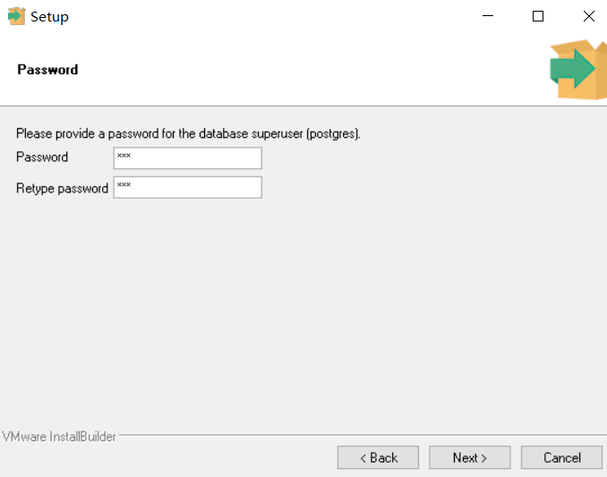
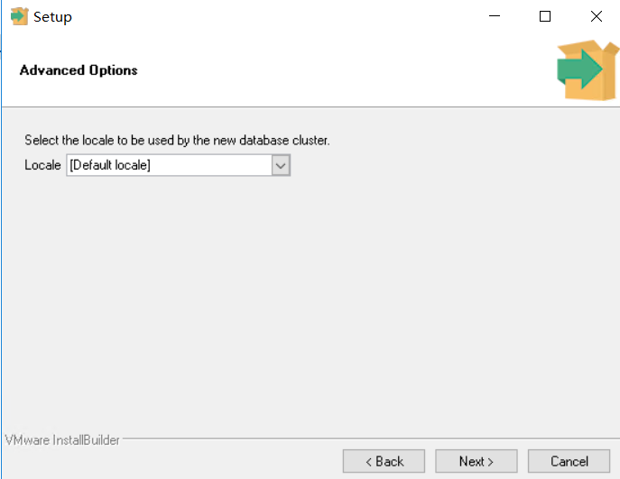
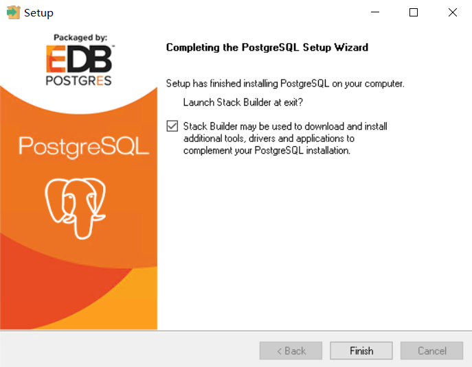
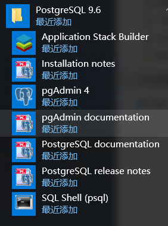
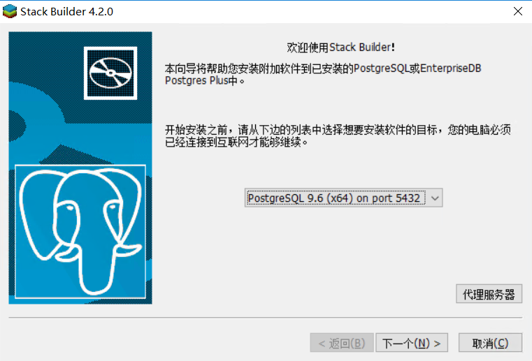
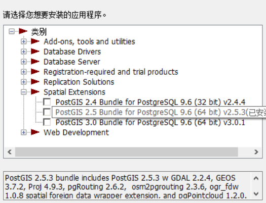
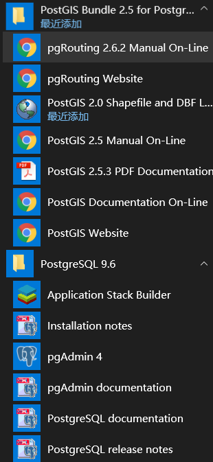

## PostgreSQL安装

### 1. 下载安装

postgreSQL下载地址： https://www.enterprisedb.com/downloads/postgres-postgresql-downloads 

本文以 9.6.18 windows 64位为例

安装步骤可以设置一路默认，设置好管理员密码，端口，安装地址和安装内容，区域（Locale）选择默认即可。

### 2. 安装stack builder

PostgreSQL安装完成后，出现以下界面，勾选选择安装stack builder(或者在postgreSQL目录打开)

**出现问题：不能连接上applications-v2.xml**

解决办法：

1. 尝试下[以下方法]( https://serverfault.com/questions/555125/postgresql-stack-builder-installation-proxy-setting-on-windows )(未使用过)

2. 关闭安全中心的实时保护（在本人电脑上有效）

选择安装postGIS插件版本，安装地址要**和postgresql的安装路径一致**，接下来，一路默认安装即可。

空间扩展

安装完成！

### 参考：

[postgresql+postgis安装、postgresql汉化]( https://blog.csdn.net/rrrrroy_Ha/article/details/90751760 )